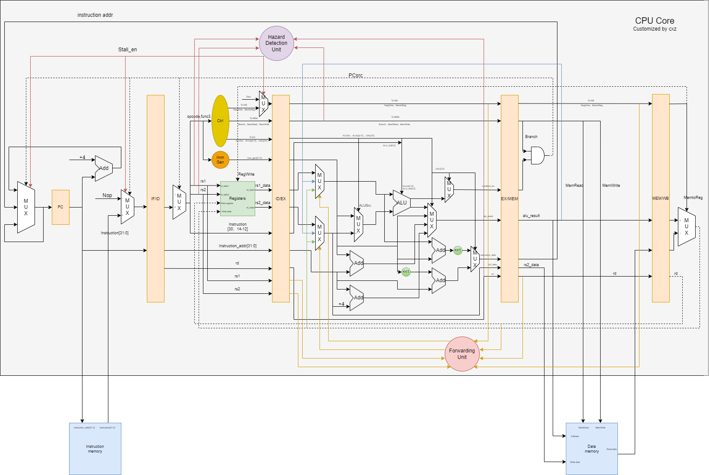

这是一个RV32I指令集的项目工程：
包含一个CPU_core,
纯手写

参考资料：

1.计算机组成与设计（RISC-V版）

2.B站教程【手把手教你设计RISC-V 处理器 第0期-蓄势待发】 https://www.bilibili.com/video/BV1ZA4y197ng/?share_source=copy_web&vd_source=a0ec423bbe4962f2deda44719a1ed5eb

3.CSDN和EETOP等网站资料


```
my_code
├─ 📁book
│  ├─ 📄RISC-V手册.pdf
│  └─ 📄riscv-card.pdf
├─ 📁b站risc工程文件
├─ 📁my_rtls
│  ├─ 📁module
│  │  ├─ 📄123.bin
│  │  ├─ 📄data_memory.v
│  │  ├─ 📄defines.v
│  │  ├─ 📄dff_sync.v
│  │  ├─ 📄double_port_ram.v
│  │  ├─ 📄execute.v
│  │  ├─ 📄execute2memory.v
│  │  ├─ 📄forwarding_unit.v
│  │  ├─ 📄hazard_detection_unit.v
│  │  ├─ 📄instruction_decode.v
│  │  ├─ 📄instruction_decode2execute.v
│  │  ├─ 📄instruction_fetch.v
│  │  ├─ 📄instruction_fetch2instruction_decode.v
│  │  ├─ 📄instruction_memory.v
│  │  ├─ 📄memory.v
│  │  ├─ 📄memory2write_back.v
│  │  ├─ 📄registers.v
│  │  └─ 📄write_back.v
│  ├─ 📁useless_old_code
│  └─ 📄RV32I_core.v
├─ 📁my_tbs
│  ├─ 📁generated
│  ├─ 📁inst_txt
│  ├─ 📄RV32I_sim.v
│  └─ 📄sim2.v
├─ 📄README.md
├─ 📄Risc-v_cpu_core.drawio
└─ 📄Risc-v_cpu_core.png
```

## 设计总览图

